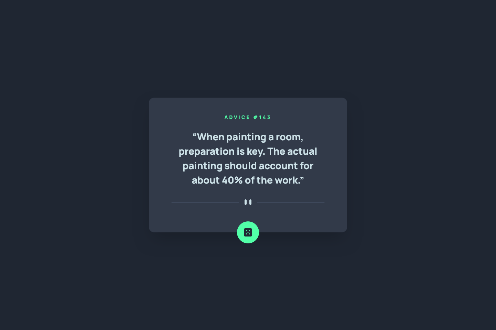
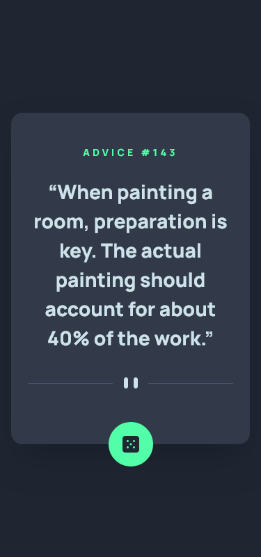

# Frontend Mentor - Advice generator app solution

This is a solution to the [Advice generator app challenge on Frontend Mentor](https://www.frontendmentor.io/challenges/advice-generator-app-QdUG-13db). Frontend Mentor challenges help you improve your coding skills by building realistic projects.

## Table of contents

- [Overview](#overview)
  - [The challenge](#the-challenge)
  - [Screenshot](#screenshot)
  - [Links](#links)
- [My process](#my-process)
  - [Built with](#built-with)
- [Author](#author)

## Overview

### The challenge

Users should be able to:

- View the optimal layout for the app depending on their device's screen size
- See hover states for all interactive elements on the page
- Generate a new piece of advice by clicking the dice icon

### Screenshots

#### Desktop

#### Mobile

### Links

- Solution URL: [https://github.com/Akiz-Ivanov/advice-generator-app](https://github.com/Akiz-Ivanov/advice-generator-app)
- Live Site URL: [https://akiz-ivanov.github.io/advice-generator-app/](https://akiz-ivanov.github.io/advice-generator-app/)

## My process

### Built with

- Semantic HTML5 markup
- CSS custom properties
- Flexbox
- Mobile-first workflow
- [React](https://reactjs.org/) - JS library
- [TypeScript](https://www.typescriptlang.org/) - For type safety
- [Tailwind CSS](https://tailwindcss.com/) - For styles
- [Vite](https://vitejs.dev/) - Build tool
- [Advice Slip API](https://api.adviceslip.com/) - Random advice data
- [React Spinners](https://www.davidhu.io/react-spinners/) - Loading indicators

## Author

- Frontend Mentor - [@Akiz97](https://www.frontendmentor.io/profile/Akiz97)
- GitHub - [@Akiz-Ivanov](https://github.com/Akiz-Ivanov)